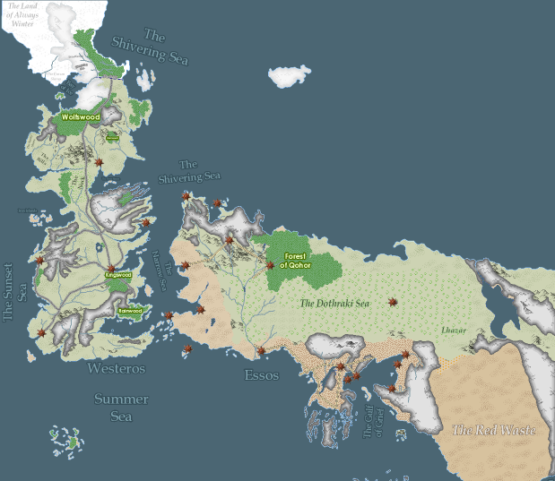
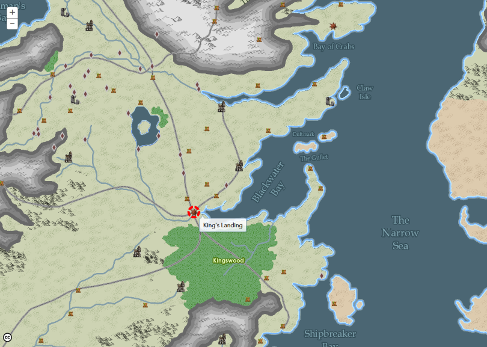
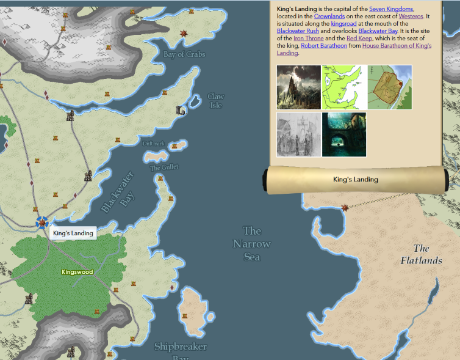
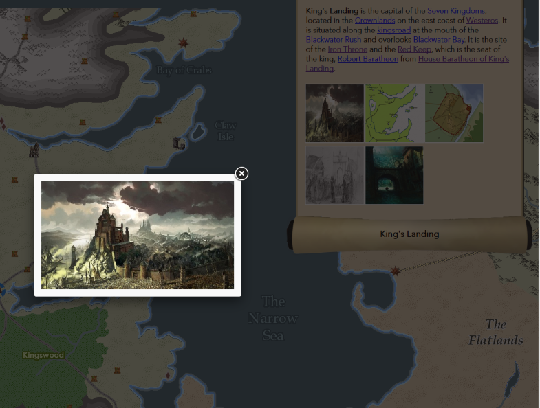

# A Map of Ice and Fire #

By: [Erica Morra](https://github.com/emorra), [Amr Eldib](https://github.com/AmrEldib), [Adam Marinelli](https://github.com/amarinelli).

You may have read the books. You probably watched the show. But you definitely know about Game of Thrones. And, if there’s one thing to know, it’s that: it’s SO. DAMN. COMPLICATED. 

…which is a good thing. We love you, Mr, Martin.

(Here's a hilarious [video](https://www.youtube.com/watch?v=qhFD67yOScY) that gives a three minutes summary of the whole thing. Spoiler for Season 1 at the end).  

A friend once told me: A picture is maybe worth a thousand words, but a map is definitely worth a thousand pictures.  
So, to help understand the show and the books, we took one of the most comprehensive maps of the fictional middle ages and brought it into the real modern one.

We’ve dispatched [Varys’](http://awoiaf.westeros.org/index.php/Varys) little birds across [the narrow sea](http://awoiaf.westeros.org/index.php/Narrow_sea) and into [the Wiki of Ice and Fire](http://awoiaf.westeros.org/index.php/Main_Page) to collect everything there is on all the different cities, castles, ruins, and man-made wonders of Westros.

We took a drawn raster map of the known world of Westros and digitized every part of it. This is a completely new basemap, built from scratch, made of 12 layers and turned into a tile cache. Then, uploaded it to ArcGIS Online.

We've scraped and collected data from the [Wiki of Ice and Fire](http://awoiaf.westeros.org/index.php/Main_Page). This includes summary description and images of cities, towns, castles and ruins.

We used ArcGIS's Javascript API to build an application for the map. With few tweaks we've managed to completely change the look and feel of the application to match that of the subject matter.

We've used: ArcMap, ArcGIS Online, Python, Node.js, JSAPI, Dojo, and jQuery.

This is an ongoing effort that will go on till the last season of the show, and the last page of the last book. As fans continue to uncover more and more of the details of this world, they bring together all they learnt into one map. Public contribution is a one of the functionalities we'd like to build beyond the scope of this contest.
Meanwhile, we can explore this map to discover one Wall, two Continents, three dragons, four TV seasons, five books, nine free cities, 18 Layers, 430MB of tile cache, 838 features and more than 10,000 points of data.
All come together for one epic journey.

Enjoy!

#### Technical Details ####
- The folder 'gis_data' holds a copy of the GIS data along with the Python and Node.js scripts used to collect attribute data.
- Data is in Shapefile format for interoperability purposes.
- The file 'ArcGIS Online Service URLs.txt' points to the data as hosted on AGOL.
- The folders 'css', 'data', 'images', 'lib', and 'script' are all the application's files.
- For any questions, please contact any of the developers or submit an issue to this project.

#### License ####
- This map was created based on the work of [theMountainGoat](http://www.sermountaingoat.co.uk/map/) and [Tear of the Cartographer's Guild](http://www.cartographersguild.com/finished-maps/6683-westeros-fan-project.html). It's offered under the Creative Commons Attribution-NonCommercial-ShareAlike 3.0 Unported License.
- This map is offered under the Creative Commons Attribution-NonCommercial-ShareAlike 3.0 Unported License. You are free to Share and Remix. You must attribute the work to its original creators. You may NOT use this work for commercial purposes. Your resulting work may be distributed under the same or similar license. Thank you.
