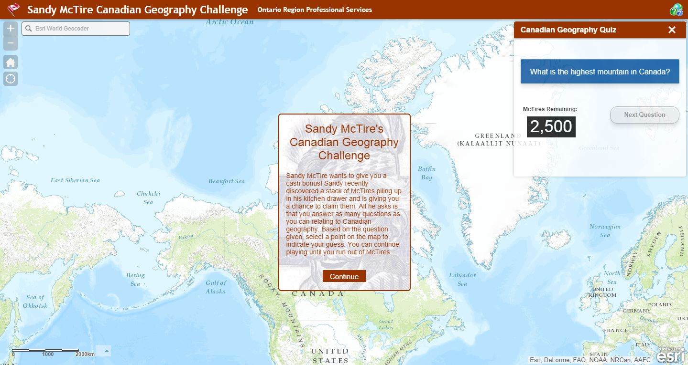

Canadian Geography Quiz with Sandy McTire
==============

## Team Members

*Heather Hainsworth, Jonathon Hooper and Geoff Mortson*

The Canadian Geography Quiz application is a widget that can be used in the Web App Builder. The application uses a feature service published with questions and answers. This widget can be used for many purposes, from organizations engaging clients, to teachers helping students learn through interactive quizzes.

[Try it live](http://ctc-dev/McTireGeographyQuiz/ "Geography Quiz")

## Value Proposition

Like Whitney Houston, we believe that children are our future. This tool can be adapted to any geography based quiz, just create a feature service with questions and answers, update some titles in the code and you are off to the races, making the world a better place. Why do we need a tool like this? Judith Adler, a sociology professor at Memorial University of Newfoundland ignited a debate on the topic. Judith had given her students a pop quiz in geography and what she found was concerning "…a sizeable portion of the students would have no idea where the Mediterranean Sea is, circle Africa to indicate Europe and locate England and Ireland in Africa." She found that roughly 75% of her students failed the pop quiz. The Geography Quiz is here to help.

Disagree with Whitney Houston? More interested in the bottom line? This tool can help there too. The Geography Quiz widget can be used in marketing promotions, or on company websites as a tool to introduce clients to the organization. Rather than read the About Us page, why not have visitors interact with the usual About US content learning about the company as they progress through the quiz? 

And finally it's take your parent to school day and all you have to talk about are projections. Little Tina or little Tommy are sure to get beat up in the playground after his mom or dad talked about the controversy of the Gall–Peters projection. How about having the kids walk through a quiz allowing them to interact and learn? Can you say Parent of the Year? Make room on the bookshelf for the Prom King or Queen crown.

## Instructions

### Getting Started

* Zoom or use the locator to find your answer
* Click to drop a point and submit your guess
* The application will deduct the distance to the correct answer from your answer in kilometres. You only have so many McTires (kilometres) to play with. 
* If you end up with the correct answer you will not lose any McTires. 
* The goal is to finish the quiz without losing all your McTires. 

## Resources
[Canadian Tire](http://www.canadiantire.ca/en.html "Canadian Tire")

[CBC: Professor says students can't identify continents on map](http://www.cbc.ca/news/canada/newfoundland-labrador/professor-says-students-can-t-identify-continents-on-map-1.1324022 "Geography knowledge")

This application uses:
*3.10 version of
[Esri's ArcGIS API for JavaScript](http://help.arcgis.com/en/webapi/javascript/arcgis/);
see the site for concepts, samples, and a reference for using the API to create mapping web sites.
*Web AppBuilder for ArcGIS (Beta) http://doc.arcgis.com/en/web-appbuilder/

